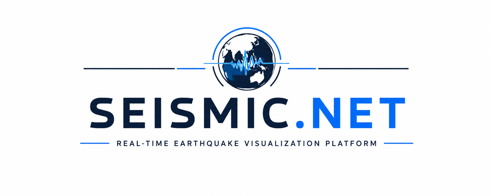
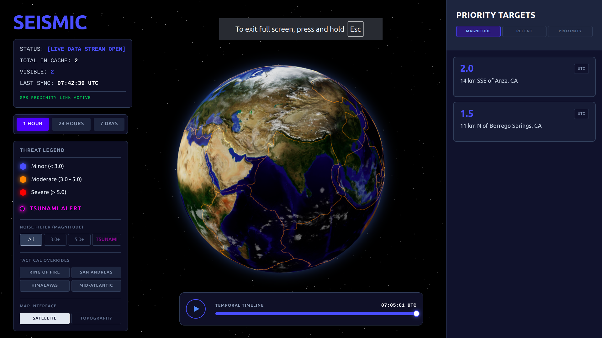
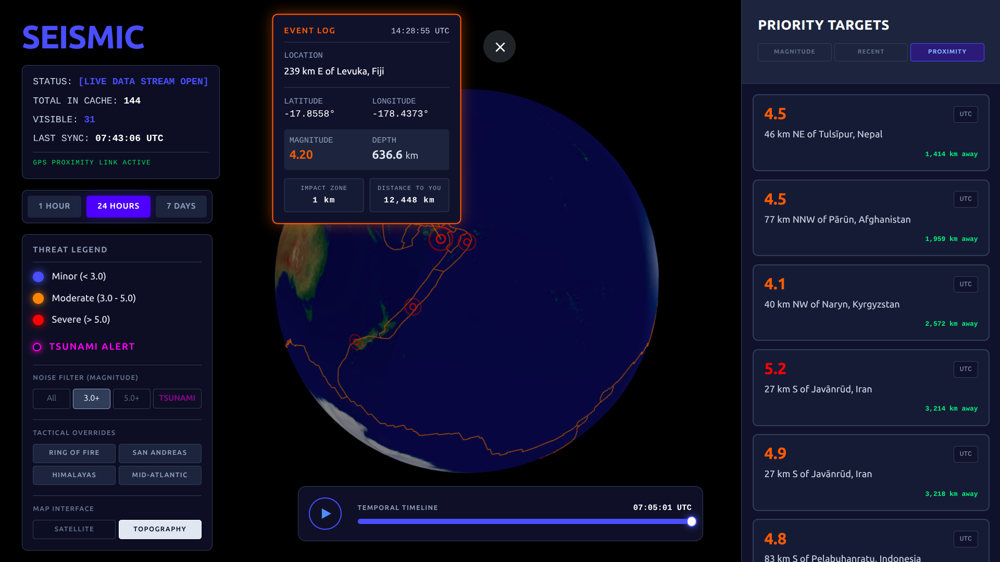
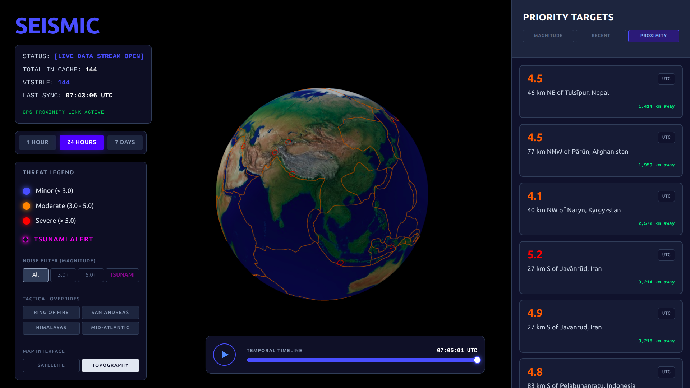
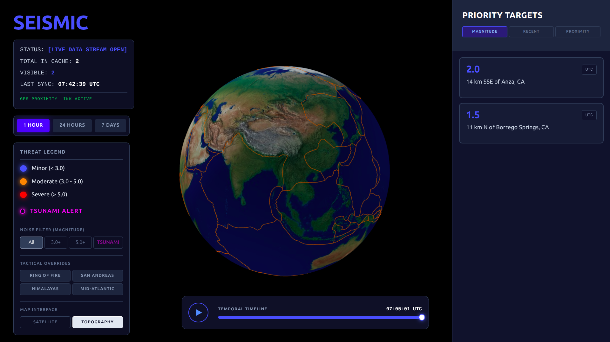

<p align="center">
  
</p>

<h1 align="center">🌍 Seismic.NET</h1>

<p align="center">
Real-Time 3D Earthquake Visualization & Seismic Intelligence Platform
</p>

<p align="center">


</p>

---

## 📑 Table of Contents

- Overview
- Demo
- Features
- Screenshots
- System Architecture
- Visualization Pipeline
- Event Processing Workflow
- Tech Stack
- Folder Structure
- Installation
- Future Improvements
- License

---

# 🌍 Overview

Seismic.NET is a tactical 3D earthquake visualization platform that transforms raw seismic feeds into an interactive global command center.

Instead of displaying earthquakes as static rows in a table, Seismic.NET renders the entire Earth in real time, allowing users to explore seismic activity spatially through an immersive WebGL interface.

The platform consumes live USGS earthquake feeds, processes thousands of seismic events, and renders them directly on a physically accurate 3D globe with multiple visualization modes.

It combines modern frontend rendering, real-time networking, and geospatial visualization into a responsive dashboard suitable for research, education, and disaster monitoring.

---

# 🎬 Demo

<p align="center">

</p>

---

# ✨ Features

## 🌎 Interactive 3D Earth

- Fully rotatable Earth
- Smooth camera controls
- Satellite Mode
- Terrain Mode
- Dark Tactical Mode


## 📡 Live Earthquake Monitoring

- Live USGS feed
- Automatic refresh
- Real-time event rendering
- Earthquake clustering


## 🎯 Smart Event Visualization

- Magnitude-based colors
- Depth visualization
- Animated event markers
- Clickable earthquake events


## 📊 Command Dashboard

- Live statistics
- Active earthquake count
- Synchronization timestamp
- Priority target panel
- Threat legend


## ⚠ Threat Classification

Minor

Moderate

Severe

Tsunami Alerts


## ⏳ Timeline Playback

Replay historical earthquake activity.

- 1 Hour
- 24 Hours
- 7 Days


## 📍 Tactical Navigation

Quick jump presets:

- Ring of Fire
- San Andreas
- Himalayas
- Mid Atlantic Ridge


## 🔍 Interactive Event Inspection

Clicking any event displays

- Magnitude
- Depth
- Coordinates
- Timestamp
- Location

---

# 📸 Screenshots

## Main Dashboard




## Event Information Panel




## Timeline Playback




## Dark Tactical Mode


## Terrain Visualization



---

# 🏗 System Architecture


## Data Flow

```
USGS Feed
      │
      ▼
Backend Server
      │
      ▼
WebSocket Stream
      │
      ▼
React Client
      │
      ▼
Three.js Renderer
      │
      ▼
Interactive Globe
```

---

# 🌐 Visualization Pipeline


# ⚡ Event Processing Workflow


# 🛰 Rendering Pipeline

```
USGS JSON Feed

        │

Latitude
Longitude
Magnitude
Depth

        │

Coordinate Conversion

        │

3D Cartesian Coordinates

        │

Three.js Scene Graph

        │

GPU Rendering

        │

Interactive Globe
```

---

# 🎨 Rendering Features

## Earth Rendering

- Physically rendered globe
- Multiple map textures
- Atmospheric glow
- Cloud layer
- Night mode


## Marker Rendering

- Magnitude scaling
- Color gradients
- Animated pulses
- Depth indication


## Camera

- Orbit Controls
- Smooth interpolation
- Auto focus
- Region presets

---

# 🛠 Tech Stack

| Layer | Technology |
|----------|------------|
| Frontend | React |
| Rendering | Three.js |
| 3D Framework | React Three Fiber |
| Animation | Drei |
| Backend | Node.js |
| Real-Time | WebSockets |
| Data Source | USGS Earthquake API |
| Styling | CSS |
| Build Tool | Vite |

---

# 📂 Folder Structure

```
Seismic.NET
│
├── backend-service
│
├── frontend-client
│
├── docs
│   ├── architecture
│   ├── screenshots
│   ├── demo.gif
│   └── banner.png
│
└── README.md
```

---

# 🚀 Installation

## Clone

```bash
git clone https://github.com/yourusername/seismic.net.git
```

---

## Backend

```bash
cd backend

npm install

npm start
```

---

## Frontend

```bash
cd frontend

npm install

npm run dev
```

---

Open

```
http://localhost:5173
```

---

# 🎯 Future Improvements

- Docker Deployment
- Redis Cache
- Historical Database
- Multi-user Synchronization
- Predictive Risk Heatmaps
- AI-based Pattern Detection
- Custom Region Monitoring
- Mobile Responsive Dashboard
- Offline Event Playback

---

# 📜 License

This project is licensed under the MIT License.

---

<p align="center">

Built using React • Three.js • WebSockets • Real-Time Geospatial Visualization

</p>